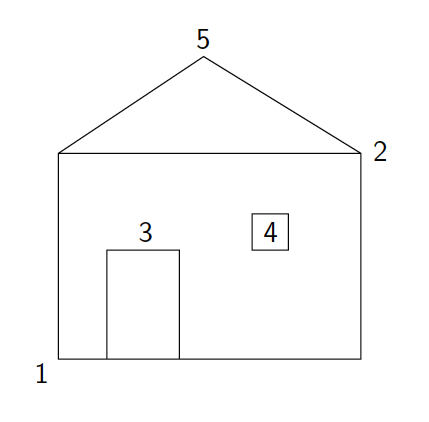

# Programming Assignment 6 - Problem 4

**Goal**
- Student uses interaction to create picture

**Instructions**

- You are to write a program that allows the user to draw a simple house using five mouse-clicks. 
- Comment sections of your code to explain what each section does.
- The first two clicks will be the opposite corners of the rectangular frame of the house. 
- The third click will indicate the center of the top edge of a rectangular door. 
- The door should have a total width that is 1/5 of the width of the house frame. 
- The sides of the door should extend from the corners of the top down to the bottom of the frame. 
- The fourth click will indicate the center of a square window. 
- The window is half as wide as the door. 
- The last click will indicate the peak of the roof. 
- The edges of the roof will extend from the point at the peak to the corners of the top edge of the house frame.
- See the diagram below

